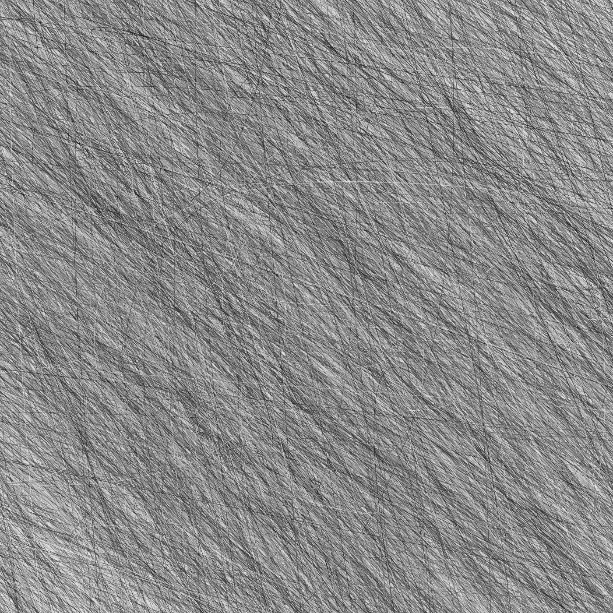
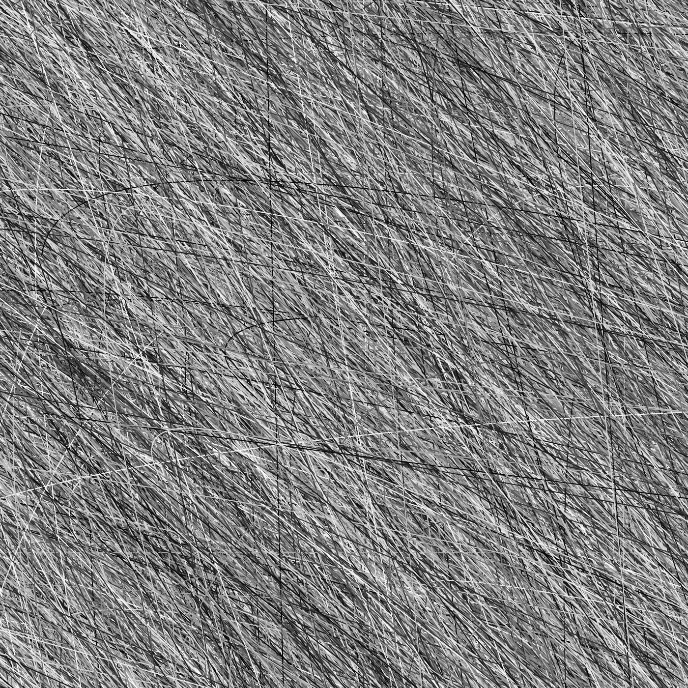
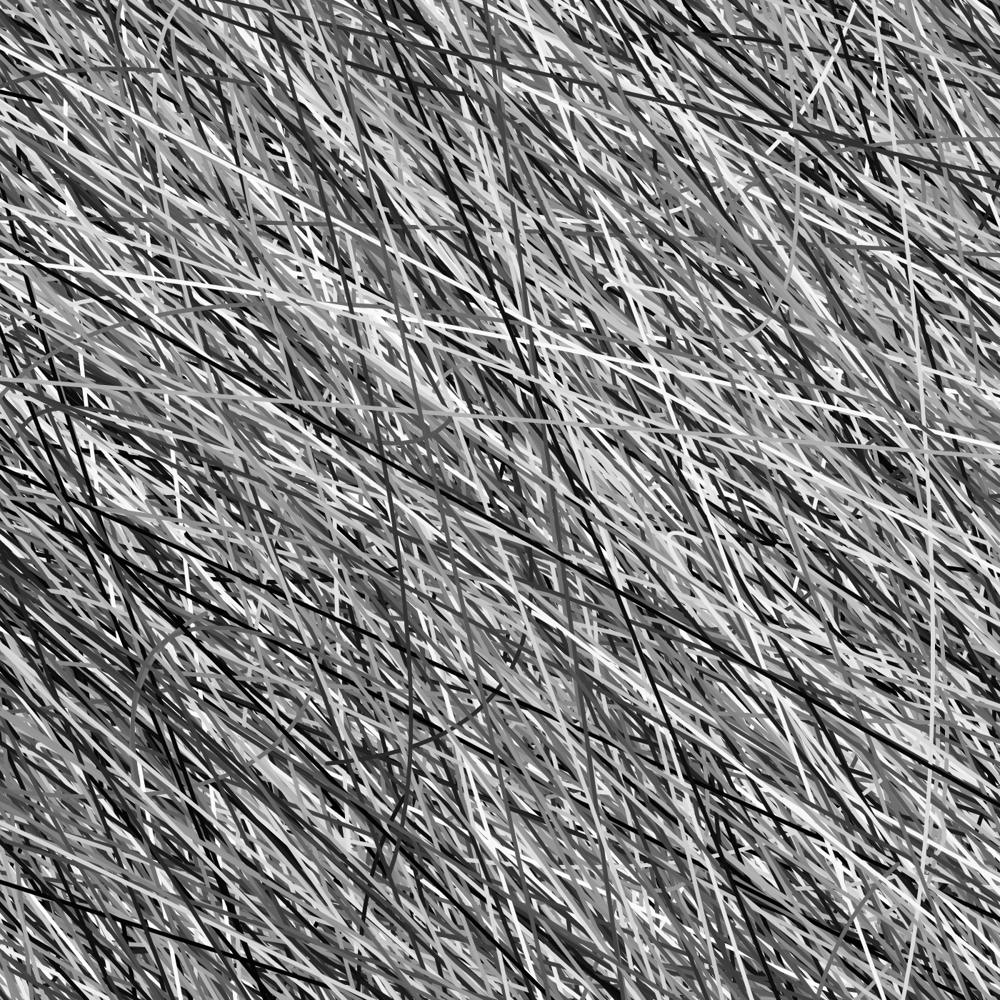
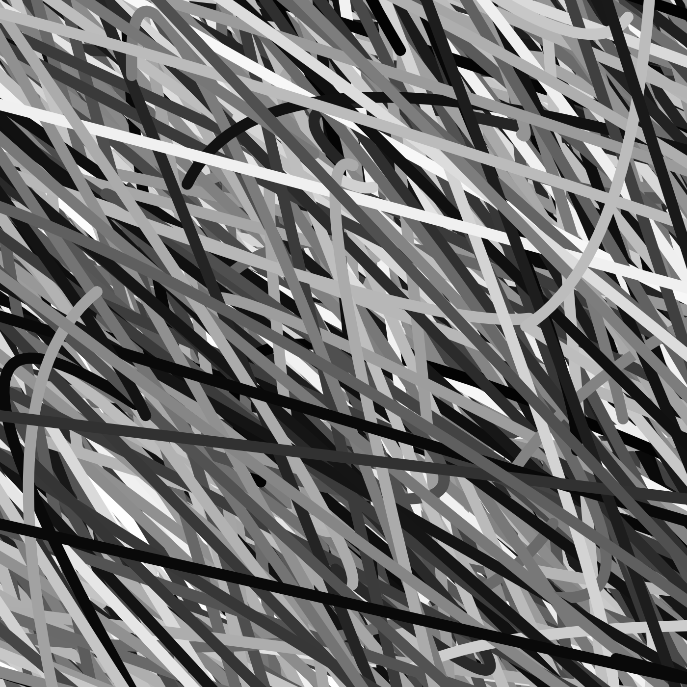
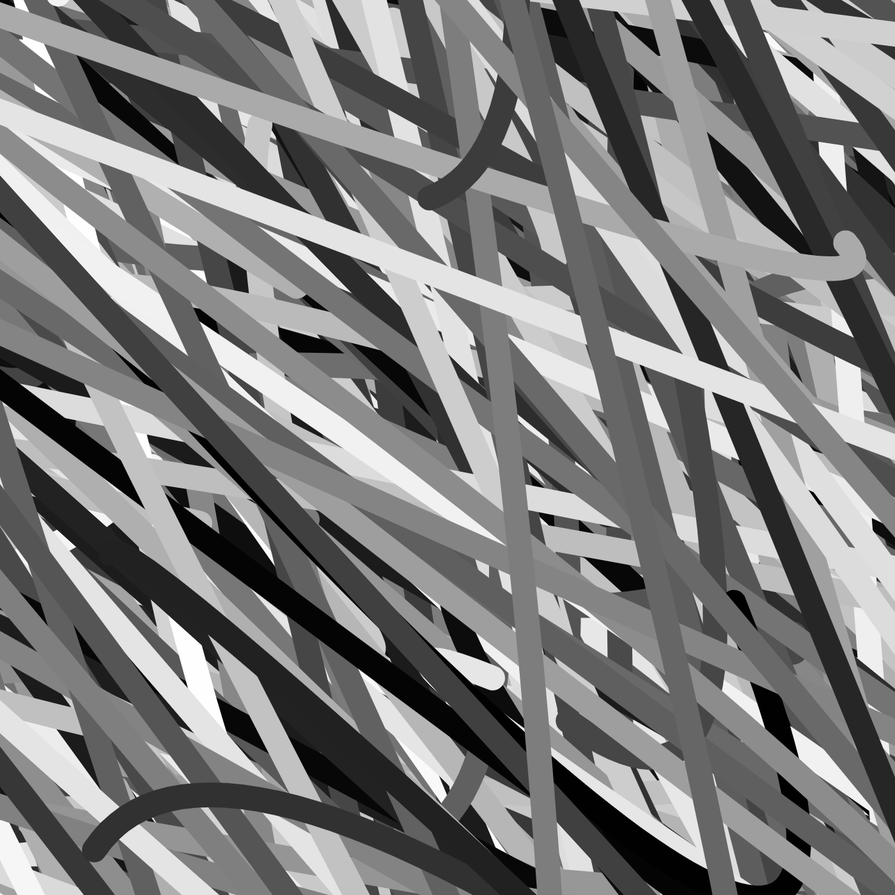

### Generative Artwork Using Object-Oriented Programming(OOP)
## Wall-Series
# Below is a series of random generated curves assigned in an array covering the whole canva.





# Code
````
let Currrrves = []; //set the array for later use

let num = 10000; //a changable variable assigning how many random curves I want to generate

//Here is a class of randomly placed, created, drawn curves
class RandomCurves {
  constructor(i, w, x, y, z) {
    strokeWeight(random(i));
    this.x1 = random(w);
    this.y1 = random(w);
    this.x2 = random(x);
    this.y2 = random(x);
    this.x3 = random(y);
    this.y3 = random(y);
    this.x4 = random(z);
    this.y4 = random(z);
    this.color = random(0, 255);
  }

  //display function of curves
  display() {
    noFill();
    stroke(this.color);
    curve(
      this.x1,
      this.y1,
      this.x2,
      this.y2,
      this.x3,
      this.y3,
      this.x4,
      this.y4
    );
  }
}

function setup() {
  createCanvas(700, 700);
  //create an array full of random curves objects
  for (let i = 0; i < num; i++) {
    Currrrves[i] = new RandomCurves(
      20,
      random(i),
      -random(i),
      random(i),
      -random(i)
    );
  }
  noLoop();
}

function draw() {
  background(220);
  for (let i = 0; i < num; i++) {
    //keep changing the start point to set up the curve while displaying
    push();
    translate(random(width), random(height));
    Currrrves[i].display();
    pop();
  }
}
````
# Problems and Challenges
I overcame a challenge from last assignment, which is to figure out how to reset the translate function back to (0,0) and assign a new spot I want it to be.
However, I still ran into other problems in this assignment. I am a bit confused of the generation of randomness in the program. The random number it produced does not seem that random to me but just select a random number at first and stick to that number instead of regenerate it.
