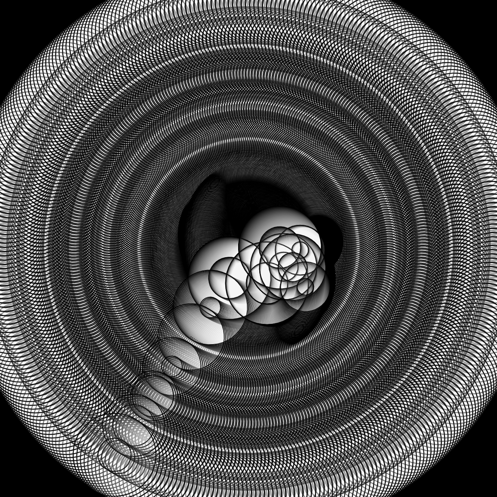

# Lunar
### Lunar new year just passed, and I was thinking making something related to the event. 

````
let x = 30;
let y = 30;
let angle = 0;

function setup() {
  createCanvas(600, 600);
  angleMode(DEGREES);
  background(0);
}

function draw() {
  //form a series of circles that turn around the center in fixed speed
  fill(255, 10);
  translate(300, 300);
  rotate(angle);
  let i = 0;
  while (i < 7) {
    ellipse(x + i * 30, y + i * 30, 100 - i * 10);
    ellipse(x + i * 30, y + i * 30, 50 - i * 25);
    i++;
  }
  //form another set of circles that spin slowly around the center area
  translate(10, 10);
  fill(255, 10);
  rotate(-angle);
  i = 0;
  while (i < 3) {
    ellipse(x + i * 20, y - i * 20, 100 - i * 20);
    ellipse(x + i * 20, y - i * 20, 50 - i * 15);
    i++;
  }
  //form another set of circles that spin slowly around the center area
  translate(10, 10);
  fill(255, 10);
  rotate(-angle);
  i = 0;
  while (i < 3) {
    ellipse(x - i * 20, y + i * 20, 100 - i * 20);
    ellipse(x - i * 20, y + i * 20, 50 - i * 15);
    i++;
  }
  angle++;
}
````
### Process and Problems
I was tring to replicate the logo of a brand but I cannot make the picture spin and rotate in the way I want it to. 
So, I just randomly assign more circle in a pattern and make them all rotate together.
Later, I felt the whole thing is too plain and clean and decided to add into some other rotation in the center area to form a sense of chaos within the rules.
However, I am still not very familiar with how to rotate the drawings as the way I picture them in my head and need to try out more to figure out.
